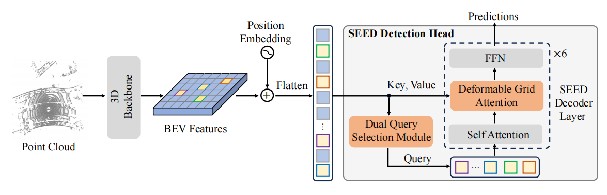

<div align="center">

# SEED

### [SEED: A Simple and Effective 3D DETR in Point Clouds]()

[Zhe Liu](https://github.com/happinesslz) <sup>1,* </sup>,
[Jinghua Hou](https://github.com/AlmoonYsl) <sup>1,* </sup>,
[Xiaoqing Ye](https://shuluoshu.github.io/)  <sup>2</sup>,
[Tong Wang](https://scholar.google.com/citations?user=EpUu4zIAAAAJ) <sup>2</sup>,
[Jingdong Wang](https://jingdongwang2017.github.io/) <sup>2</sup>,
[Xiang Bai](https://xbai.vlrlab.net/) <sup>1,✉</sup>
<br>
<sup>1</sup> Huazhong University of Science and Technology,
<sup>2</sup> Baidu Inc.
<br>
\* Equal contribution, ✉ Corresponding author.
<br>

**ECCV 2024**

</div>

**Abstract** Recently, detection transformers (DETRs) have gradually taken a dominant position in 2D detection thanks to their elegant framework. However, DETR-based detectors for 3D point clouds are still difficult to achieve satisfactory performance. We argue that the main challenges are twofold: 1) How to obtain the appropriate object queries is challenging due to the high sparsity and uneven distribution of point clouds; 2) How to implement an effective query interaction by exploiting the rich geometric structure of point clouds is not fully explored.
To this end, we propose a simple and effective 3D DETR method (SEED) for detecting 3D objects from point clouds, which involves a dual query selection (DQS) module and a deformable grid attention (DGA) module. More concretely, to obtain appropriate queries, DQS first ensures a high recall to retain a large number of queries by the predicted confidence scores and then further picks out high-quality queries according to the estimated quality scores. DGA uniformly divides each reference box into grids as the reference points and then utilizes the predicted offsets to achieve a flexible receptive field, allowing the network to focus on relevant regions and capture more informative features. Extensive ablation studies on DQS and DGA demonstrate its effectiveness. Furthermore, our SEED achieves state-of-the-art detection performance on both the large-scale Waymo and nuScenes datasets, illustrating the superiority of our proposed method.



## News
* **2024.07.02**: SEED has been accepted at ECCV 2024. 🎉

### Results on Waymo Open

* **Validation set (single frame)**

| Model | mAP/mAPH_L1  | mAP/mAPH_L2 | Vec_L1 | Vec_L2 | Ped_L1 | Ped_L2 | Cyc_L1 | Cyc_L2 |
|-------------------------------------------------------------------------------------------|:------------:|:-------:|:-------:|:-------:|:-------:|:-------:|:-------:|:-------:|
| SEED-S   |  79.3/76.9   | 73.1/70.8 | 78.2/77.7 | 70.2/69.7 | 81.3/75.8 | 73.3/68.1 | 78.4/77.2 | 75.7/74.5 |
| SEED-B  |  80.9/78.8   | 74.9/72.8 | 79.7/79.2 | 71.8/71.4 | 83.1/78.3 | 75.5/70.8 | 80.0/78.8 | 77.3/76.1 |
| SEED-L    |  81.5/79.5   | 75.5/73.5 | 79.8/79.3 | 71.9/71.5 | 83.6/79.1 | 76.2/71.8 | 81.2/80.0 | 78.4/77.3 |

* **Test set  (3 frames)**

| Model | mAP/mAPH_L1  | mAP/mAPH_L2 | Vec_L1 | Vec_L2 | Ped_L1 | Ped_L2 | Cyc_L1 | Cyc_L2 | Leaderboard |
|-------|:------------:|:-----------:|:-------:|:-------:|:-------:|:-------:|:-------:|:-------:|:-------:|
| SEED-L  |  83.5/82.1   |  78.7/77.3  | 84.3/83.9 | 77.5/77.1 | 85.2/82.3 | 79.9/77.0 | 81.0/80.1 | 78.7/77.8 | [link](https://waymo.com/open/challenges/detection-3d/results/13405607-47a3/1709782897550042/)|

We could not provide the above pretrained models due to [Waymo Dataset License Agreement](https://waymo.com/open/terms/).


## TODO
- [ ] Release the paper.
- [ ] Release the code of SEED on Waymo.
- [ ] Release the code of SEED on nuScenes.


## Citation
```
@inproceedings{
  liu2024seed,
  title={SEED: A Simple and Effective 3D DETR in Point Clouds},
  author={Liu, Zhe and Hou, Jinghua and Ye, Xiaoqing and Wang, Tong, and Wang, Jingdong and Bai, Xiang},
  booktitle={ECCV},
  year={2024},
}
```

## Acknowledgements
We thank these great works and open-source repositories:
[OpenPCDet](https://github.com/open-mmlab/OpenPCDet), [ConQueR](https://github.com/V2AI/EFG), [FocalFormer3d](https://github.com/NVlabs/FocalFormer3D) and [MMDetection3D](https://github.com/open-mmlab/mmdetection3d).
